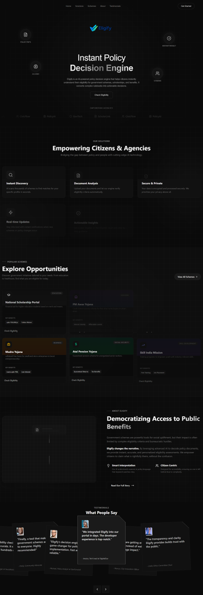
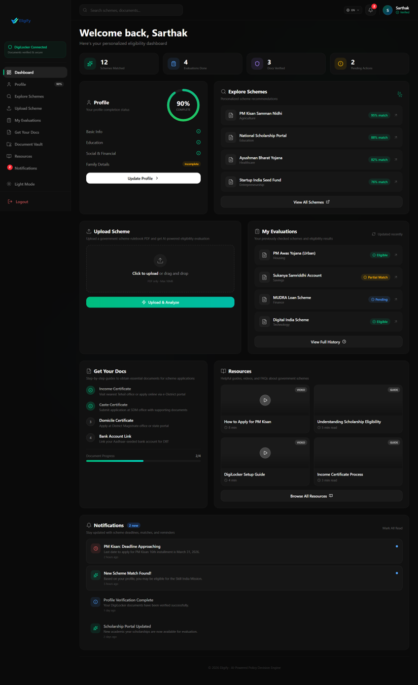
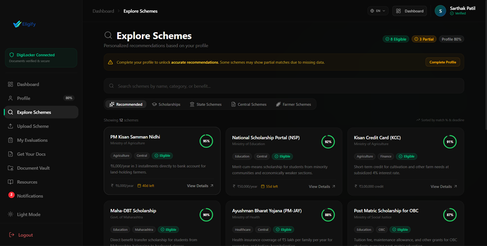
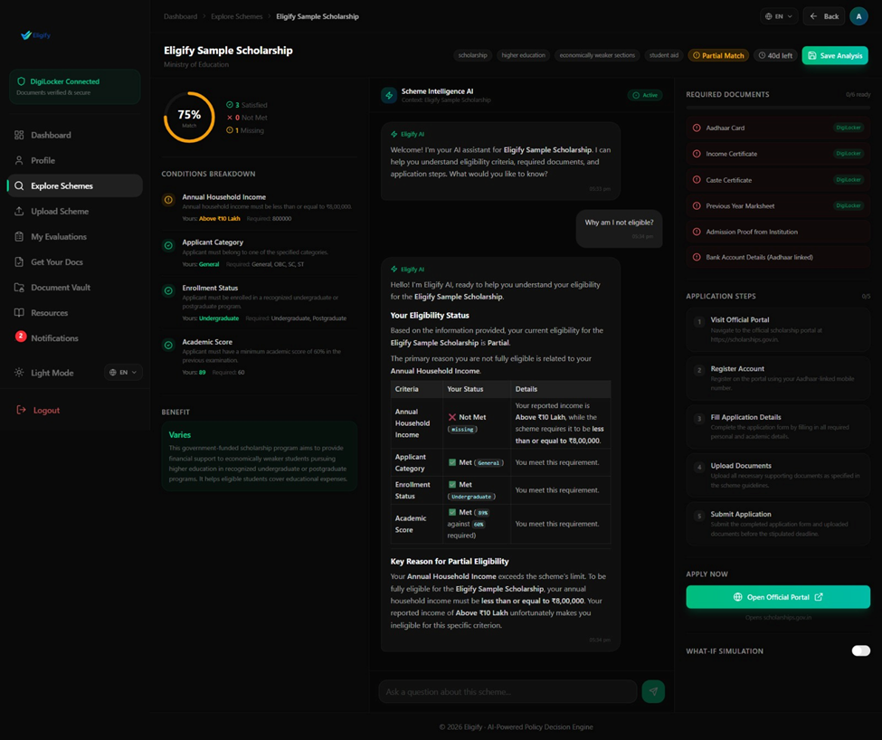
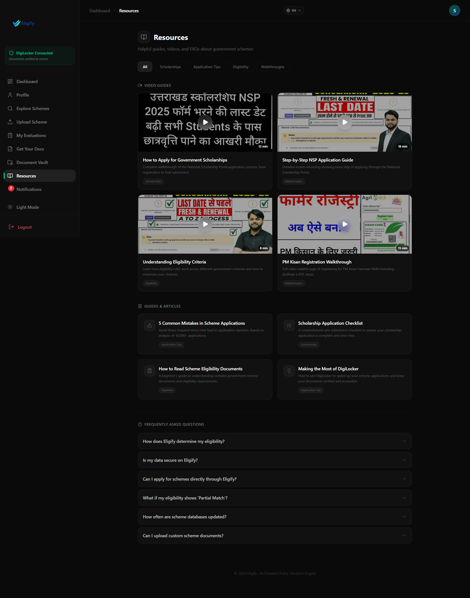

# Eligify - AI Policy Decision Engine

Eligify is an intelligent platform designed to democratize access to public benefits. It leverages AI to decode complex government policy documents and helps citizens instantly check their eligibility for various schemes, scholarships, and social welfare programs.

By bridging the gap between bureaucratic logic and citizen needs, Eligify ensures transparency, precision, and ease of access for everyone.

## 🚀 Features

-   **AI-Driven Eligibility Check**: Instantly analyzes user profiles against thousands of policy rules.
-   **Smart Scheme Discovery**: Recommendations for scholarships, housing, housing, and healthcare schemes.
-   **Modern User Interface**: A premium, responsive design with dark mode aesthetics (Dark Blue & Cyan theme).
-   **Document Analysis**: (Concept) automated verification of documents against criteria.
-   **Integrated Architecture**: Next.js frontend served seamlessly by a robust Django backend.

##  Screenshots

<!-- Paste your image links here -->

### Landing Page

### Dashboard


### Explore Schemes


### Evaluation Results


### Resources


## 🛠️ Tech Stack

-   **Frontend**: Next.js 16 (React 19), TypeScript, Tailwind CSS v4, Framer Motion, Lucide Icons, @react-oauth/google.
-   **Backend**: Django 5 (Python), DRF, django-allauth, google-genai (Gemini AI), pdfplumber (PDF Analysis).
-   **Authentication**: JWT tokens with djangorestframework-simplejwt.
-   **Architecture**: Static export of Next.js frontend served via Django static file handling.

## 📋 Getting Started

Follow these instructions to set up and run the project locally.

### Prerequisites

-   **Node.js**: v18.17.0 or higher (Recommended v20+) - [Download](https://nodejs.org/)
-   **Python**: v3.10 or higher (Recommended v3.11+) - [Download](https://www.python.org/downloads/)
-   **Git**: For version control - [Download](https://git-scm.com/downloads)
-   **npm** (Node Package Manager): Usually comes with Node.js.
-   **pip** (Python Package Installer): Comes with Python.

### Installation

1.  **Clone the Repository**

    ```bash
    git clone https://github.com/Sarthakpatil23/DevCraft-TECH-AROSA.git
    cd DevCraft-TECH-AROSA
    ```

2.  **Frontend Setup (Next.js)**

    Navigate to the `eligify` directory to install dependencies and build the static assets.

    ```bash
    cd eligify
    npm install
    
    # Build the static export (Required for Django to serve the UI)
    npm run build
    ```

    *Note: This creates an `out` directory containing the HTML/CSS/JS files.*

3.  **Backend Setup (Django)**

    Navigate to the `backend` directory to set up the Python environment.

    ```bash
    cd ../backend
    
    # Create a virtual environment
    python -m venv venv
    
    # Activate the virtual environment
    # On Windows:
    venv\Scripts\activate
    # On macOS/Linux:
    # source venv/bin/activate
    
    # Install dependencies
    pip install -r requirements.txt
    
    # Apply database migrations
    python manage.py migrate
    
    # Apply database migrations
    python manage.py migrate

    # Configure Environment Variables
    # Create a .env file in the backend root directory (c:\ELIGIFY\backend\.env)
    # Add your Google Gemini API Key:
    # GEMINI_API_KEY=your_api_key_here
    
    # Configure Google OAuth (Required for authentication)
    # Run the following command to set up OAuth credentials:
    python manage.py shell -c "from allauth.socialaccount.models import SocialApp; from django.contrib.sites.models import Site; site = Site.objects.get(id=1); site.domain = '127.0.0.1:8000'; site.name = 'Eligify Local'; site.save(); app, created = SocialApp.objects.get_or_create(provider='google', name='Google OAuth', defaults={'client_id': 'YOUR_GOOGLE_CLIENT_ID', 'secret': 'YOUR_GOOGLE_CLIENT_SECRET'}); app.sites.add(site); print('Google OAuth configured')"
    
    # Replace YOUR_GOOGLE_CLIENT_ID and YOUR_GOOGLE_CLIENT_SECRET with your actual Google OAuth credentials
    # Get credentials from: https://console.cloud.google.com/apis/credentials
    ```

### 🏃‍♂️ Running the Application

Once both frontend build and backend setup are complete:

1.  Ensure you are in the `backend` directory with your virtual environment activated.
2.  Start the Django development server:

    ```bash
    python manage.py runserver
    ```

3.  Open your browser and navigate to:

    **http://127.0.0.1:8000/**

    You should see the Eligify application running. The Django server acts as the primary host, serving the Next.js frontend and handling API requests.

## 🔐 Google OAuth Setup

1.  **Create Google OAuth Credentials**:
    -   Go to [Google Cloud Console](https://console.cloud.google.com/apis/credentials)
    -   Create a new OAuth 2.0 Client ID
    -   Add authorized redirect URI: `http://127.0.0.1:8000/accounts/google/login/callback/`

2.  **Configure in Django**:
    -   After running migrations, use the shell command provided in the Backend Setup section
    -   Replace `YOUR_GOOGLE_CLIENT_ID` and `YOUR_GOOGLE_CLIENT_SECRET` with your actual credentials

3.  **Authentication Flow**:
    -   Users click "Continue with Google" on the homepage
    -   After successful OAuth, new users are redirected to onboarding
    -   Returning users with completed profiles go directly to dashboard
    -   JWT tokens are stored in localStorage for API authentication

## 🧪 Development Workflow

-   **Frontend Changes**: If you are working on the UI, you can run `npm run dev` inside the `eligify` folder for hot-reloading development. However, to see changes reflected on the Django port (8000), you must run `npm run build` again.
-   **Backend Changes**: Django will auto-reload on python file changes.
-   **OAuth Testing**: Always test OAuth flow on `http://127.0.0.1:8000/` (not `localhost`)

## 📡 Key API Endpoints

-   **Homepage**: `http://127.0.0.1:8000/` - Landing page with Google OAuth
-   **Google OAuth Login**: `http://127.0.0.1:8000/accounts/google/login/` - Initiate OAuth flow
-   **OAuth Callback**: `http://127.0.0.1:8000/auth/callback/` - OAuth success handler with JWT generation
-   **Onboarding**: `http://127.0.0.1:8000/onboarding/` - Profile completion form for new users
-   **Dashboard**: `http://127.0.0.1:8000/dashboard/` - User dashboard (requires authentication)
-   **Profile Update API**: `http://127.0.0.1:8000/api/auth/profile/update/` - PATCH endpoint to update user profile

## 🤝 Contribution

1.  Fork the repository.
2.  Create a feature branch (`git checkout -b feature/AmazingFeature`).
3.  Commit your changes (`git commit -m 'Add some AmazingFeature'`).
4.  Push to the branch (`git push origin feature/AmazingFeature`).
5.  Open a Pull Request.